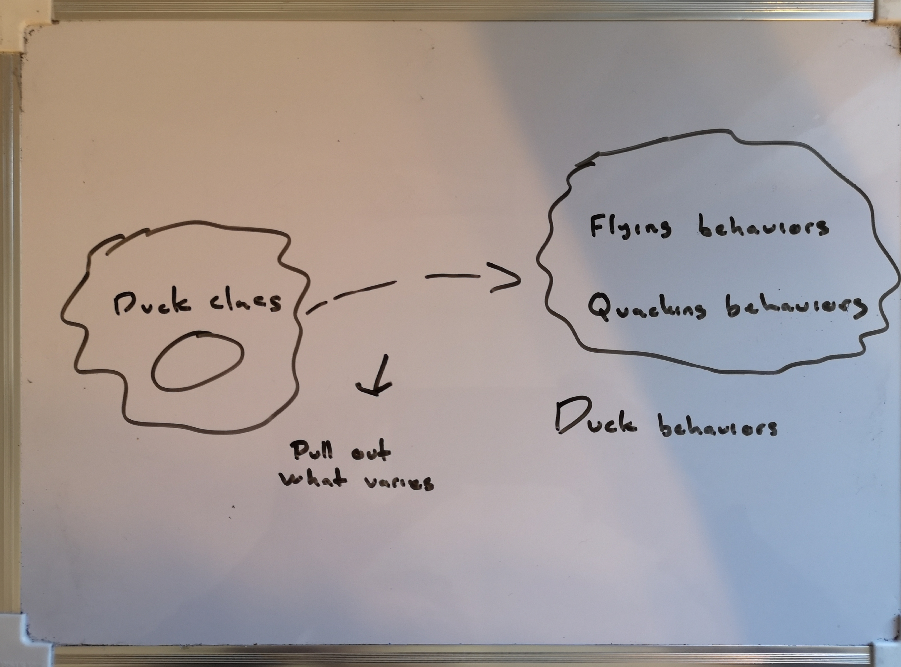

# Strategy Pattern

Define a family of algorithms, encapsulate each one, and make them interchangable. 
Strategy lets the algorithm vary independently from clients that use it.

#### Analogy

Steve and his team of developers have been assigned to create a duck pund simulation game called *SimUDuck*.

Inside the game there are a large variety of duck species swimming and making quacking sounds. Steve says 'easy-peasy' and creates a system using standard OO techniques with one Duck superclass from which all other duck types inherit, and takes his team out for an early Friday celebration drink.


Just when they have ordered their third round of the afternoon they receive a call from the manager telling them in a very enthusiastic and eager manner that they want to give the ducks the ability to fly: *This is a game changer, we will kiss our competitors good bye with this feature, she says. And it needs to be done today*.

The team look at each other. They all know it.. It is now a game of patience. Who is going to say it? The intern does not see the situation for what it is and instead sees a great opportunity to show of his design skills.

*Let's just implement a fly()-method on the Duck superclass*.

The team agrees with this. They implement a fly-method on the Duck class which maked all its subclasses inherit it.


The day after Steve wakes up hangovered. The headache is however not the worst part because his brain has now started to inform him about the night before.

**Brain**: Good morning, Steve! Yesterday you spent 300 euros and you gave gave plastic ducks the ability to fly.

**Steve**: First of all, it was Johnny, the intern, who came up with the idea and pushed the code, and second there is a quick fix to this "problem".

**Brain**: What do you mean it was Johnny? You are responsible for the code. And also, what do you mean *"problem"*? Clearly it is a problem. There are now plastic ducks flying around in the game.

**Steve**: It is called a feature, "Brain".

**Brain**: The 42 missed called from the manager tells me it is a problem.

Steve quickly starts up his laptop and comes up with this solution.


Excuse Steves handwriting for a second. His solution was to override the plastic ducks inheritetad fly-method to do nothing. Which was also Steves idea for himself for the rest of the day.

**Q: Which of the following are disadvantages of using *inheritance* to provide Duck behaviour?**

- [x] Code is duplicated across subclasses.
- [x] Runtime behaviour changes are difficult.
- [ ] We can't make ducks dance.
- [x] Hard to gain knowledge of all duck behaviours.
- [ ] Ducks can't fly and quack at the same time.
- [x] Changes can unintentionally affect other ducks.


There is some clear issues with Steves design. A plastic duck does not quack(), it has more of a squeakisk-sound. So he would also override that behaviour.

And: **The only constant is change**.

The manager has informed him that 1. he gets to keep his job for now. and 2. there will be a product update every 6 months. So he need a cleaner way to have only some (but not all) of the duck types fly or quack.

##### Zeroing in on the problem

**Design Principle**

**Identify the aspects of your application that vary and separate them from what stays the same**

Again. Take what varies and "encapsulate" it so it won't affect the rest of your code.
The result: Fewer unintended consequences from code changes and more flexibility in your systems.

If there is some aspects of the code that is changing, then you know that you have behaviour that need to be pulled out and seperated from all the things that does not change.

**Brain: identify the aspects of your application that vary and separate them from what stays the same.**

**Steve**: 

**Brain** Take the parts that vary and encapsulate them, so that later you can alter or extend the parts that vary without affecting those that don't.

**Steve**:

**Brain** Ok, let's visualize it with the ducks.




##### Seperating what changes from staying the same

We are going to create two sets of classes, totally seperated from Duck, called *fly* and *quack*
because we know that fly() and quack() is the parts of Duck that vary across ducks.

The implemntation of the seperation consists of pulling both methods out of the Duck class and create a new set of classes to represent each behaviour.


##### Designing the Duck Behaviors

**Design Principle**

**Program to an interface, not an implementation**

This design principle makes more sense if we try and examine what we want to achieve:

Flexibility. And we now know we want to *assign* behaviors to the instance of Duck. 

When we instantiate a new Duck we want to give it a specific *type* of flying behavior. It would also make sense to include behavior setter methods in order to change it's behaviour at runtime.

**Brain**: Steve, from now on, the Duck behaviors will live in a separate class - a class that implements a particular behavior interface.

**Steve**: Why?

**Brain**: Because then the Duck classes won't need to know any of the implementation details for their own behaviors.

The idea is to use an interface to represent each behavior.

```Typescript
IFlyBehavior
fly()
```


These interfaces whole purpose is represent behavior.

##### Integrating the Duck Behavior

Name of the game is delegation. the Duck class delegates its flying and quacking behavior to other classes.

**Design Principle**

Favor composition over inheritance.

*has-* vs *is-a*
*composition* vs *inheritance*

Every duck in our application *has-a* FlyBehavior to which it delegates its flying.

When you add two classes together like this, you are using composition.
The ducks gets their behavior by being composed.

### Summary

It is about using composition instead of inheritance.

The strategy pattern defines a family of algorithms, encapsulates each one, and makes them interchangeable. Strategy lets the algorithm vary independently from clients that use it.

The MallardDuck and the PlasticDuck are clients and they make use of different algorithms for example fly(). The must be able to **vary independently** from other aspects of the client.
So we extracted that method from the Duck class and instead created an interface FlyBehavior.

So now every duck *has-a* flying behavior and one quacking behavior, that can be implemented however it wants. But the to be able to call itself a duck it needs to have some sort of fly-and -quack behavior.

At the same time we said that our different class behaviors *is-a* I*Behavior.

The algorithms are the in this case fly() and quack().
They are encapsulated in their concrete classes that implements their respective interfaces.
Makes them interchangable means that we can swap them as long as they implement its interface

Quack() {quack(){}} ---> Squeak(quack(){})

With this the client duck does not need to change just because it algorithm change.


